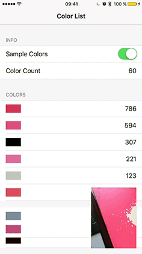

# UBRDelta

UBRDelta is a diffing framework for incremental UI updates on iOS written in Swift.

### Example



The included example reads colors from an image provided by the camera and counts the colors. The interface is a self-updating list of the most detected colors.

The framework helps to figure out which table rows needs to be inserted, removed, moved or updated.


### Base Library

The base library (UBRDelta) tracks changes in arrays that are containing types conforming to the `Comparable` protocol.

```swift
public enum ComparisonLevel {
    case Same, Different, Changed([String:Bool])
}

public protocol ComparableItem {
    // The `compareTo` function of an comparable item is expected
    // to return `.Changed`, when the `uniqueIdentifier` stayed
    // the same, but other properties changed.
    var uniqueIdentifier: Int { get }
    func compareTo(other: ComparableItem) -> ComparisonLevel
}
```

### Delta Content

On top of the base library the framework provides the `UBRDeltaContent` class that helps to update table and collection views incrementally.

Updating a table view works best when you split it up into multiple phases. First inserting, deleting and reloading rows and second moving the rows. The same is true for updating sections. To help you Delta Content provides an updated version of your data source on each step.

Because every data source is different updating the table view controller is up to the consumer of the library. You can find a complete example in the demo project.

```swift
// Configure Delta Content
deltaContent.start = { }
deltaContent.itemUpdate = { (items, section, insertIndexes, reloadIndexMap, deleteIndexes) in
    // Update items for section, then update table rows
    // tableView.beginUpdates()
    // tableView.reloadRowsAtIndexPaths(..., withRowAnimation: ...)
    // tableView.deleteRowsAtIndexPaths(..., withRowAnimation: ...)
    // tableView.insertRowsAtIndexPaths(..., withRowAnimation: ...)
    // tableView.endUpdates()
}

deltaContent.itemReorder = { (items, section, reorderMap) in
    // Update items for section, then update table view rows
    // tableView.beginUpdates()
    // tableView.moveRowAtIndexPath(..., toIndexPath: ...)
    // tableView.endUpdates()
}

deltaContent.sectionUpdate = { (sections, insertIndexes, reloadIndexMap, deleteIndexes) in
    // Update section, then update table view
    // self.sections = sections
    // tableView.beginUpdates()
    // tableView.reloadSections(..., withRowAnimation: ...)
    // tableView.endUpdates()
}

deltaContent.sectionReorder = { (sections, reorderMap) in
    // self.sections = sections
    // tableView.beginUpdates()
    // tableView.moveSection(..., toSection: ...)
    // tableView.endUpdates()
}

deltaContent.completion = { }

// Perform UI update
deltaContent.queueComparison(oldSections: ..., newSections: ...)

```

### Installation

UBRDelta can be installed via carthage.


### Special Thanks

Special Thanks to [Dwifft](https://github.com/jflinter/Dwifft) by jflinter for writing an algorithm that solves the Longest Common Subsequence problem in Swift.
